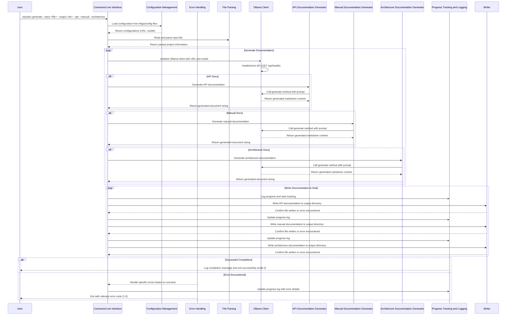

## Architecture

The architecture of `repodoc` consists of several core components that work together to generate documentation from Git repositories using Ollama. Below is an overview of these components and how they interact with each other.

### Components Overview

1. **CLI Interface**: The command-line interface provides users with the ability to specify input files, output directories, and select different types of documentation to generate.
2. **Configuration Management**: Handles configuration from flags or config files, including URL for Ollama API and model name.
3. **Error Handling**: Centralized error handling and standardized exit codes for various failure scenarios.
4. **File Parsing**: Reads and processes input files to extract information needed for generating documentation.
5. **Ollama Client**: Interacts with the Ollama API to generate content based on provided prompts.
6. **Documentation Generators**: Different generator classes responsible for creating specific types of documentation (API, Manual, Architecture).
7. **Progress Tracking and Logging**: Provides real-time feedback during execution and detailed logs for debugging.

### Component Interaction



### Detailed Component Descriptions

#### Command-Line Interface (CLI)

The CLI is the entry point for users. It allows them to specify input files and output directories, as well as select which types of documentation they want to generate.

```python
import typer
from typing import Optional

app = typer.Typer()

@app.command()
def generate(
    input_file: str,
    output_dir: str,
    api: bool = False,
    manual: bool = False,
    architecture: bool = False,
) -> None:
    # CLI logic here
```

#### Configuration Management

Handles the configuration settings provided by the user via command-line flags or config files. This includes the URL for the Ollama API and the model name to be used.

```python
class ConfigManager:
    def __init__(self, url: str, model_name: str) -> None:
        self.url = url
        self.model_name = model_name

    @staticmethod
    def from_flags(url: str, model_name: str):
        return ConfigManager(url=url, model_name=model_name)
```

#### Error Handling

Centralized error handling to manage different failure scenarios gracefully. Each error type corresponds to a specific exit code.

```python
from enum import IntEnum

class ExitCode(IntEnum):
    SUCCESS = 0          # normal termination
    GENERAL = 1          # unexpected runtime error
    CONFIG = 2           # configuration file / flag issues
    INPUT_FILE = 3       # missing or invalid --input file
    OLLAMA = 4           # cannot reach Ollama server / bad model
    OUTPUT_DIR = 5       # unable to create / write output dir

class GeneralError(Exception):
    pass

# Other specific error classes (ConfigError, InputFileError, etc.)
```

#### File Parsing

The file parsing component reads and processes the input file provided by the user. It extracts the necessary information to generate documentation.

```python
from lxml import etree

def parse_input_file(file_path: str) -> dict:
    tree = etree.parse(file_path)
    root = tree.getroot()
    # Parse logic here
    return parsed_data
```

#### Ollama Client

The `OllamaClient` handles communication with the Ollama API. It includes methods for checking the health of the API and generating documentation content.

```python
import httpx

class OllamaClient:
    def __init__(self, url: str, model_name: str) -> None:
        self.url = url
        self.model_name = model_name

    async def healthcheck(self) -> bool:
        try:
            response = await httpx.get(f"{self.url}/api/health", timeout=2)
            return response.status_code == 200
        except (httpx.RequestError, httpx.HTTPStatusError):
            return False

    async def generate(self, prompt: str) -> str:
        # Implementation for generating documentation content
```

#### Documentation Generators

Different generators are responsible for creating specific types of documentation. These include the API generator, manual generator, and architecture generator.

```python
from abc import ABC, abstractmethod

class DocGenerator(ABC):
    @abstractmethod
    async def generate(self, project_info: dict, client: OllamaClient) -> str:
        pass

# Example implementation for ApiGenerator
class ApiGenerator(DocGenerator):
    async def generate(self, project_info: dict, client: OllamaClient) -> str:
        # Build English prompt and call Ollama API
        return await client.generate(prompt)
```

#### Progress Tracking and Logging

Provides real-time feedback during execution and detailed logs for debugging purposes. Uses `rich` library to create progress bars and log messages.

```python
from rich.console import Console
from rich.logging import RichHandler
import logging

logging.basicConfig(
    level="INFO",
    format="%(message)s",
    datefmt="[%X]",
    handlers=[RichHandler(console=Console(width=120))]
)

logger = logging.getLogger("rich")

# Example usage of progress bar
from rich.progress import Progress, SpinnerColumn, BarColumn

progress = Progress(
    SpinnerColumn(),
    BarColumn(),
    "[progress.percentage]{task.percentage:>3.0f}%",
)
```

By following this architecture, `repodoc` ensures a clear separation of concerns and modular design, making it easier to maintain, extend, and debug the application. Each component has a well-defined role and interacts with others through clearly defined interfaces, leading to a robust and efficient system for generating documentation from Git repositories.
